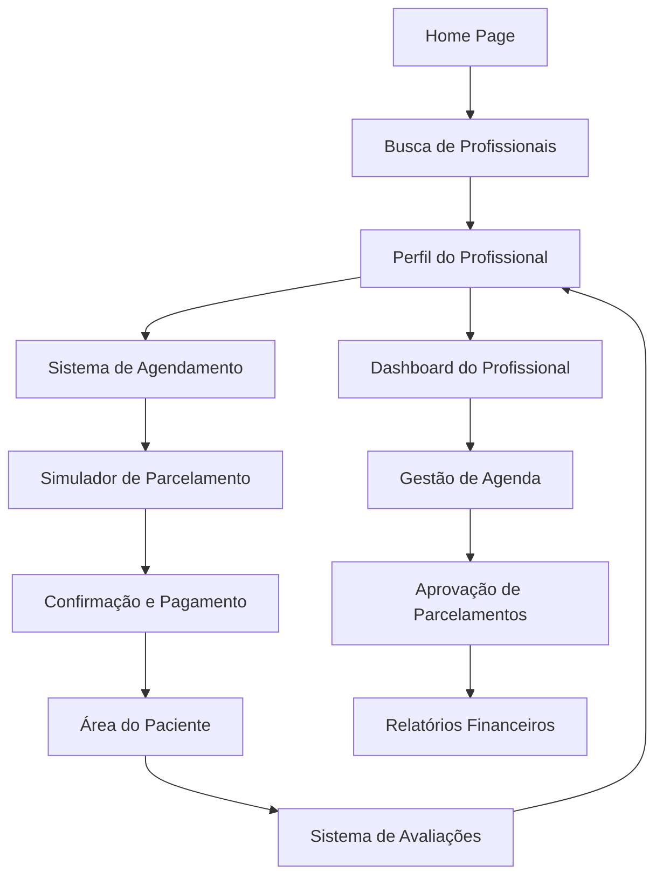

# DOUTORIZZE - Sistema de Gestão e Parcelamento para Profissionais de Saúde

## 1. Product Overview
O DOUTORIZZE é uma plataforma completa que combina gestão de agendamentos médicos com soluções de parcelamento flexível para procedimentos de saúde. <mcreference link="https://parcelamais.com/" index="1">1</mcreference> <mcreference link="https://pro.doctoralia.com.br/preco" index="2">2</mcreference>

O sistema resolve dois problemas principais: facilita o acesso de pacientes a tratamentos de saúde através de parcelamento sem cartão de crédito e oferece aos profissionais uma plataforma completa para gestão de consultas, perfis profissionais e recebimentos.

O objetivo é democratizar o acesso à saúde de qualidade, permitindo que mais pacientes realizem procedimentos através de condições de pagamento acessíveis.

## 2. Core Features

### 2.1 User Roles

| Role | Registration Method | Core Permissions |
|------|---------------------|------------------|
| Paciente | Email e CPF | Pode agendar consultas, solicitar parcelamentos, avaliar profissionais |
| Profissional de Saúde | Email, CRM e documentos | Pode gerenciar agenda, perfil, receber pagamentos, aprovar parcelamentos |
| Clínica/Administrador | CNPJ e documentos | Pode gerenciar múltiplos profissionais, relatórios financeiros, configurações |

### 2.2 Feature Module

Nosso sistema DOUTORIZZE consiste nas seguintes páginas principais:

1. **Home page**: hero section com apresentação do sistema, busca de profissionais, depoimentos de usuários.
2. **Perfil do Profissional**: informações detalhadas, especialidades, avaliações, agendamento direto.
3. **Sistema de Agendamento**: calendário interativo, seleção de horários, confirmação automática.
4. **Simulador de Parcelamento**: calculadora de parcelas, opções de pagamento, análise de crédito.
5. **Dashboard do Profissional**: gestão de agenda, pacientes, relatórios financeiros, configurações.
6. **Área do Paciente**: histórico de consultas, agendamentos, parcelas em aberto, avaliações.
7. **Sistema de Pagamentos**: processamento de parcelas, boletos, PIX, gestão financeira.

### 2.3 Page Details

| Page Name | Module Name | Feature description |
|-----------|-------------|---------------------|
| Home page | Hero Section | Apresentar valor da plataforma, busca rápida por especialidade e localização |
| Home page | Busca de Profissionais | Filtrar por especialidade, localização, disponibilidade, avaliações |
| Home page | Depoimentos | Exibir avaliações reais de pacientes e profissionais cadastrados |
| Perfil do Profissional | Informações Básicas | Mostrar especialidades, formação, experiência, CRM, fotos |
| Perfil do Profissional | Sistema de Avaliações | Exibir avaliações de pacientes, média de notas, comentários |
| Perfil do Profissional | Agendamento Rápido | Botão para agendar consulta diretamente do perfil |
| Sistema de Agendamento | Calendário Interativo | Mostrar horários disponíveis, permitir seleção de data/hora |
| Sistema de Agendamento | Confirmação Automática | Enviar confirmações por email/SMS, lembretes automáticos |
| Sistema de Agendamento | Dados do Paciente | Coletar informações necessárias, histórico médico básico |
| Simulador de Parcelamento | Calculadora de Parcelas | Simular parcelamento em até 24x, com e sem entrada |
| Simulador de Parcelamento | Análise de Crédito | Verificar limite disponível, definir condições personalizadas |
| Simulador de Parcelamento | Opções de Pagamento | PIX parcelado, boleto, transferência, sem cartão de crédito |
| Dashboard do Profissional | Gestão de Agenda | Visualizar agendamentos, cancelar/reagendar, bloquear horários |
| Dashboard do Profissional | Gestão de Pacientes | Histórico de atendimentos, prontuário básico, comunicação |
| Dashboard do Profissional | Relatórios Financeiros | Receitas, parcelamentos aprovados, comissões, extratos |
| Área do Paciente | Histórico de Consultas | Listar consultas realizadas, próximas, canceladas |
| Área do Paciente | Gestão de Parcelas | Visualizar parcelas em aberto, gerar boletos, histórico de pagamentos |
| Área do Paciente | Sistema de Avaliações | Avaliar profissionais após consultas, deixar comentários |
| Sistema de Pagamentos | Processamento de Parcelas | Gerar boletos automáticos, processar PIX, controlar vencimentos |
| Sistema de Pagamentos | Gestão Financeira | Repasse para profissionais, controle de inadimplência, relatórios |

## 3. Core Process

**Fluxo do Paciente:**
O paciente acessa a plataforma, busca por um profissional de sua especialidade, visualiza o perfil completo com avaliações e informações. Ao encontrar o profissional desejado, pode agendar uma consulta selecionando data e horário disponível. Se o valor do procedimento for alto, pode simular um parcelamento flexível sem cartão de crédito. Após aprovação do crédito, confirma o agendamento e recebe lembretes automáticos. Após a consulta, pode avaliar o profissional e acompanhar suas parcelas na área pessoal.

**Fluxo do Profissional:**
O profissional se cadastra na plataforma fornecendo documentos e informações profissionais. Configura seu perfil com especialidades, valores e disponibilidade. Gerencia sua agenda através do dashboard, aprovando ou negando solicitações de parcelamento. Recebe notificações de novos agendamentos e pode se comunicar com pacientes. Acompanha seus recebimentos e relatórios financeiros, recebendo os valores conforme os pacientes quitam suas parcelas.

## 4. User Interface Design

### 4.1 Design Style
- **Cores Primárias**: Azul médico (#4A90E2) e branco (#FFFFFF)
- **Cores Secundárias**: Verde saúde (#2ECC71) para confirmações e cinza (#95A5A6) para textos secundários
- **Estilo de Botões**: Arredondados com sombra sutil, efeito hover suave
- **Fontes**: Roboto para títulos (16-24px) e Open Sans para textos (14-16px)
- **Layout**: Design limpo e minimalista, cards com bordas arredondadas, navegação superior fixa
- **Ícones**: Material Design Icons, estilo outline para melhor legibilidade

### 4.2 Page Design Overview

| Page Name | Module Name | UI Elements |
|-----------|-------------|-------------|
| Home page | Hero Section | Banner com gradiente azul, título em Roboto 32px, botão CTA verde arredondado |
| Home page | Busca de Profissionais | Cards brancos com sombra, filtros em sidebar, resultados em grid responsivo |
| Perfil do Profissional | Informações Básicas | Layout em duas colunas, foto circular, badges para especialidades |
| Sistema de Agendamento | Calendário Interativo | Calendário estilo material design, horários em chips clicáveis |
| Simulador de Parcelamento | Calculadora | Interface tipo calculadora, sliders para parcelas, cards para opções |
| Dashboard do Profissional | Gestão de Agenda | Tabela responsiva, status coloridos, botões de ação compactos |
| Sistema de Pagamentos | Gestão Financeira | Gráficos em donut, tabelas com zebra striping, indicadores coloridos |

### 4.3 Responsiveness
O sistema é mobile-first com adaptação completa para desktop. Inclui otimização para touch em dispositivos móveis, com botões maiores e navegação por gestos. Menu hambúrguer em mobile e navegação horizontal em desktop.